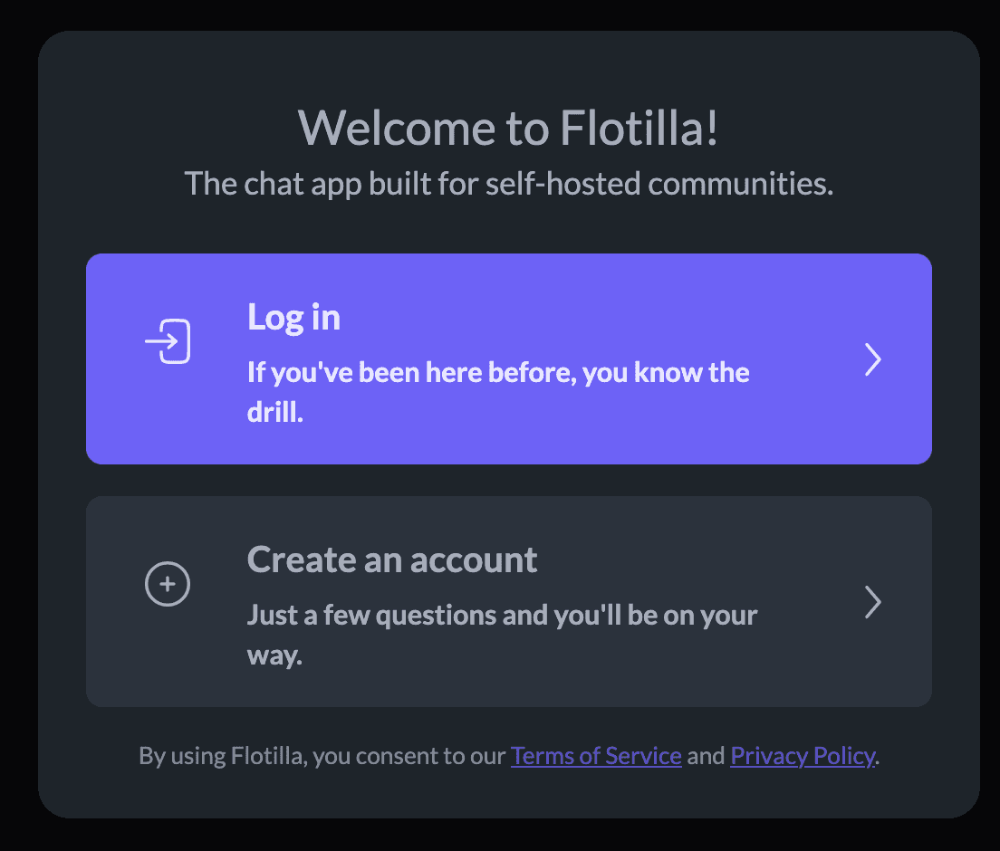
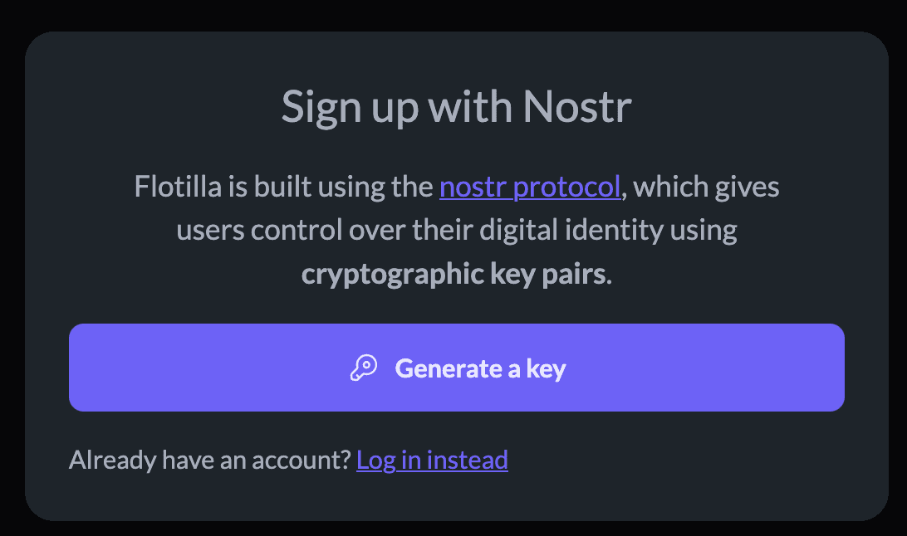
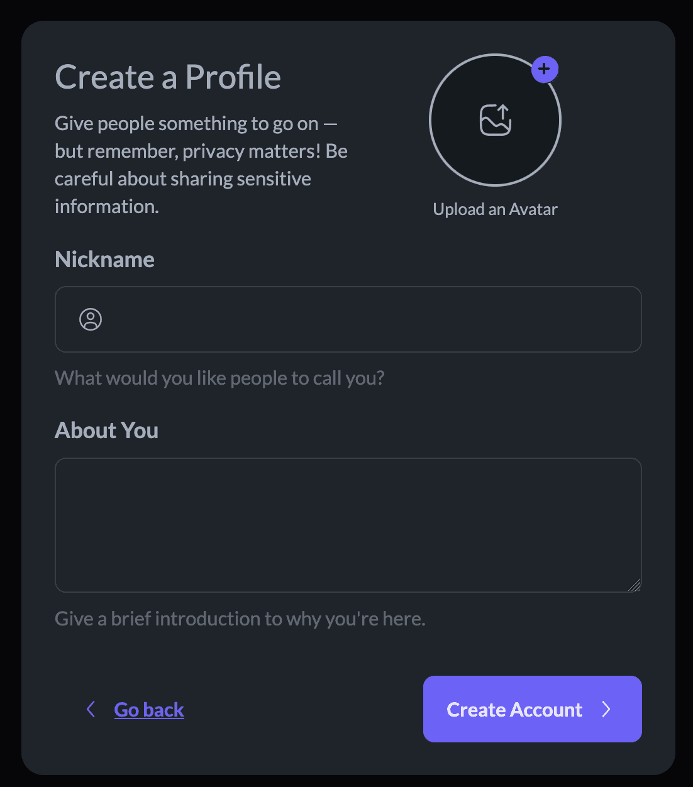
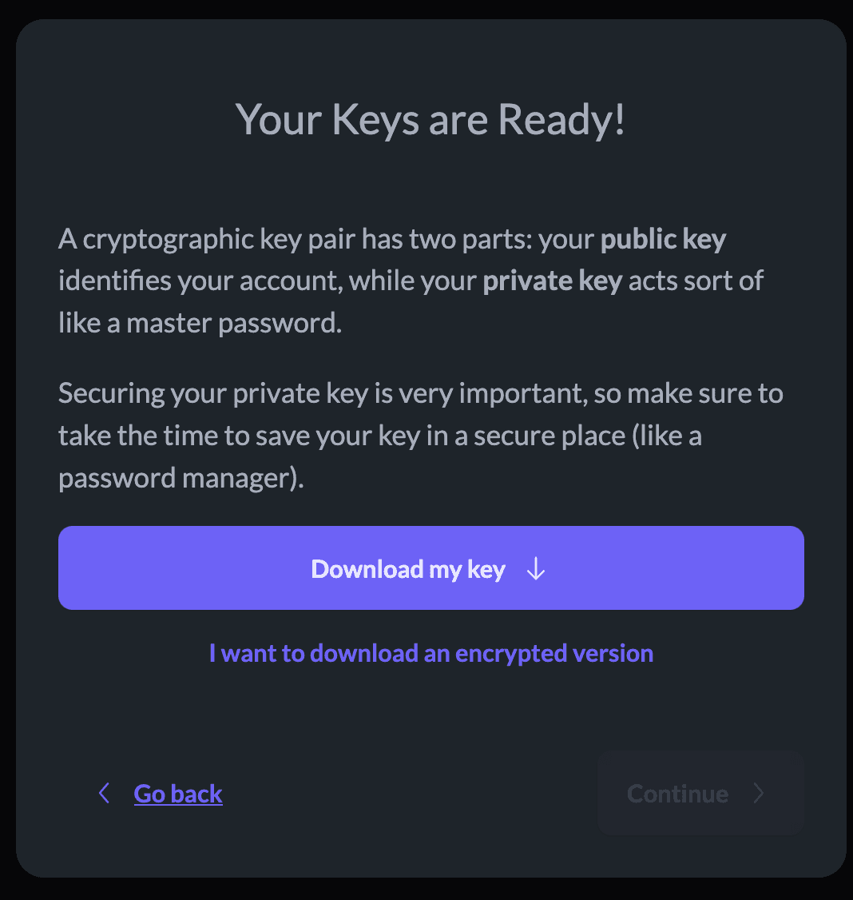
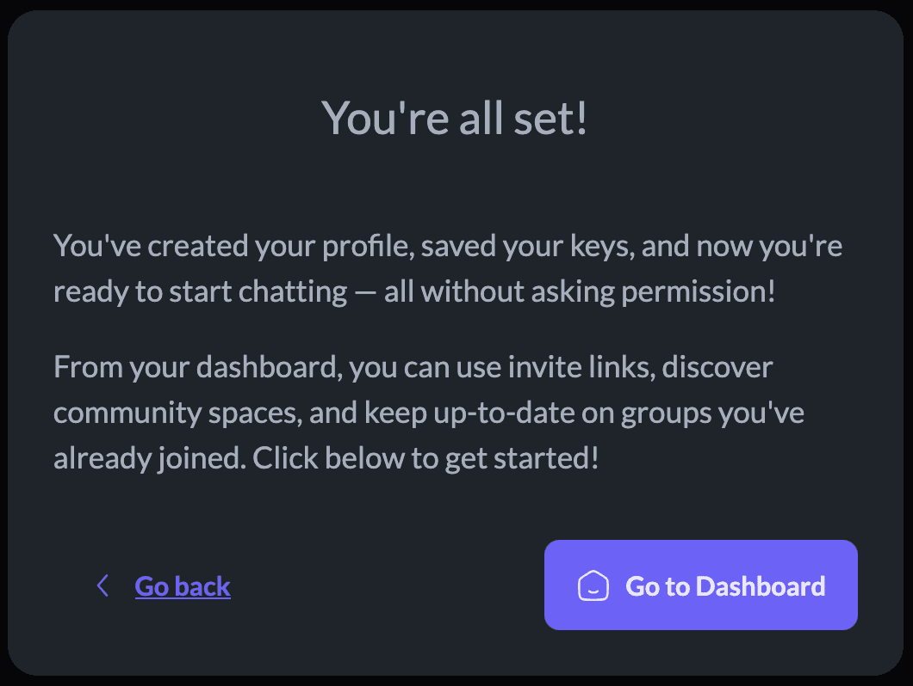

# Getting Started

To get started, visit [app.flotilla.social](https://app.flotilla.social). You'll be offered an option — log in, or sign up:

If you already have a Nostr key created via any other [nostr app](https://nostrapps.com), you can log in using that profile. Otherwise, click "Create an Account" to continue.

In Flotilla (and other Nostr apps), users don't log in using an "account", but instead they use a "key" to *prove* their identity. This is a little different, but there's a good reason we do it this way: accounts are, ultimately, owned by the *platform*, and *rented* to the user. Keys, on the other hand, belong to you, which keeps you from ever getting deplatformed, even if a service provider decides to ban you from their services.

To create a key, click "Generate a Key". This will create a new Nostr key and store it in your browser. You'll be given the opportunity to download your key and store it securely later.

Next, we'll ask you to fill out your profile information. All of this is optional, and you're free to enter anything you want.

Finally, you'll be given the chance to download your key, optionally encrypted using a password. Keep this in a safe place! If you lose it or it gets stolen, you'll lost control over your Nostr (and, by extension, Flotilla) profile. If you don't already use one, a password manager like [Bitwarden](https://bitwarden.com/) can be a good place to put it.

Once you've downloaded your key and put it somewhere safe, you're ready to connect with your community!

## Images

| local | original | alt | usage |
|---|---|---|---|
| ../assets/EFY4bw3U7nueQ7Hkznk0FzFqa3A.png | https://framerusercontent.com/images/EFY4bw3U7nueQ7Hkznk0FzFqa3A.png |  | inline body image |
| ../assets/hppIr2OPt7E32tfGRXlXs3vqHvI.png | https://framerusercontent.com/images/hppIr2OPt7E32tfGRXlXs3vqHvI.png |  | inline body image |
| ../assets/3Opa0Lmnb4pL0JZUSLuP6eAT4.png | https://framerusercontent.com/images/3Opa0Lmnb4pL0JZUSLuP6eAT4.png |  | inline body image |
| ../assets/19DWPG9XmU4u0UU2htz1xxvboGo.png | https://framerusercontent.com/images/19DWPG9XmU4u0UU2htz1xxvboGo.png |  | inline body image |
| ../assets/WP4icdnIyNEdKEpcxr8MlGPJ44A.png | https://framerusercontent.com/images/WP4icdnIyNEdKEpcxr8MlGPJ44A.png |  | inline body image |
