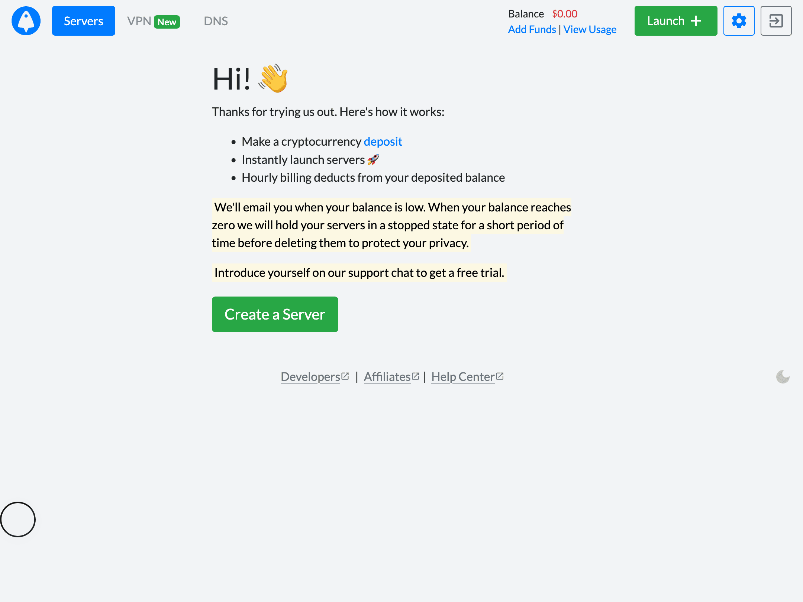
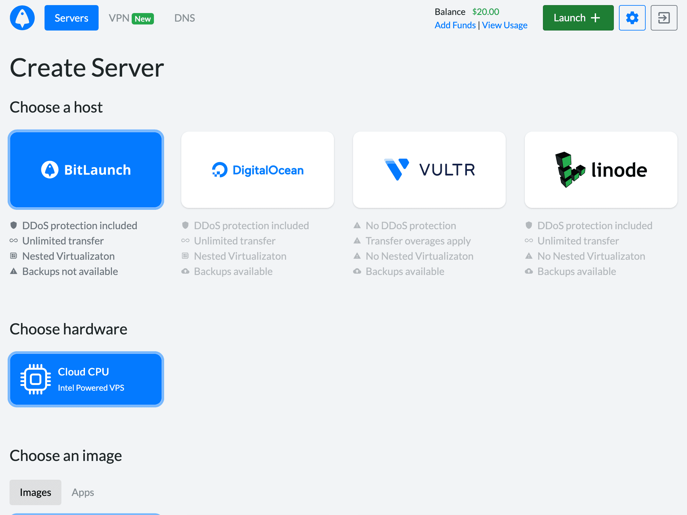
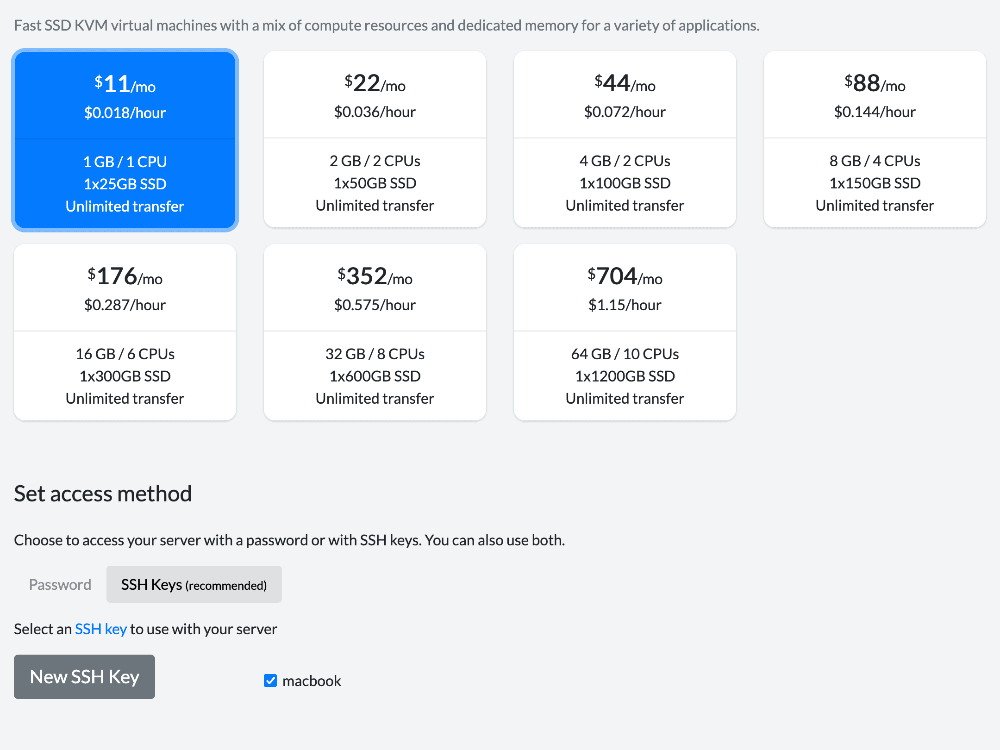
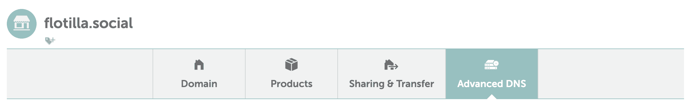
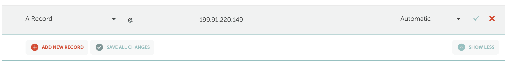
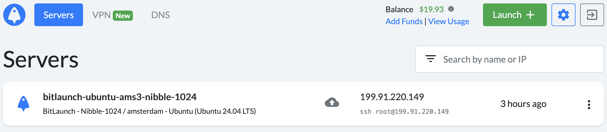
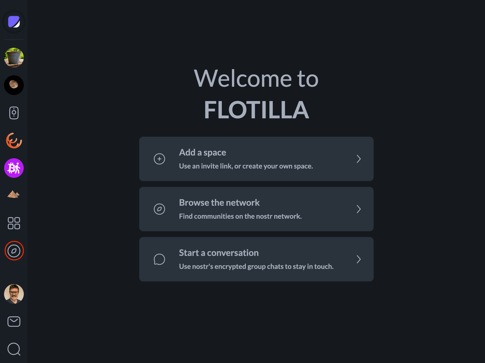

# Self Hosting a Space

One of the great things about the cryptographic identities Nostr uses to identify users is that they automatically reduce your exposure to de-plaforming, simply because your social identity can't be taken away from you. And if you keep a backup of your events, you're also safe from losing your content and social graph! But there's no way to get around the fact that *someone* has to run the servers.

As a regular Nostr user, self-hosting is mostly a nice-to-have. But if you're a community organizer, you have people who depend on you to keep their content private and secure. Depending on the size and nature of your community, as well as your own level of technical skill, it might be worthwhile to run your space on infrastructure you control. This decision comes with certain trade-offs, but it can be well worthwhile depending on your goals.

This guide will walk you through provisioning a virtual private server, installing docker compose, provisioning a relay, and connecting to it in Flotilla.

### Getting a Server

In this tutorial, we'll be using [BitLaunch](https://bitlaunch.io/) which provides domains and servers KYC-free and payable in bitcoin — but you can use any server provider you're comfortable with.



Once you've confirmed your email and deposited some bitcoin, click "Create a Server". In this tutorial we'll go with the default settings — a BitLaunch Ubuntu 24.04 $11/mo VPS.



For access, you can pick either a password, or you can upload your ssh public key. Using an ssh key is more secure, and more convenient, but you can always start with a password and switch to ssh later if you prefer. See [here](https://docs.github.com/en/authentication/connecting-to-github-with-ssh/generating-a-new-ssh-key-and-adding-it-to-the-ssh-agent) for directions on how to set up an ssh key.



When everything looks good, click "Launch Server" at the bottom of the page. It'll take a few minutes for the server to boot, so now is a good time to set up your domain. You can use any DNS provider you want, but I'll use [namecheap](https://www.namecheap.com/).

Visit your domain list, and click "Manage" next to the domain you want to host your relay on. Next, click "Advanced DNS" then "Add New Record".



Choose "A Record" and enter the IP address of your new server in the "IP Address" field. If you're using your domain itself, enter `@` in the "Host" field, otherwise enter the subdomain (for example, if you want your relay to be available at "relay.yourdomain.com", enter "relay".



Click the check mark button, and you're done with DNS.

Once the VPS is done booting, click to copy the `ssh <your ip address>` command and paste it into your [terminal](https://www.freecodecamp.org/news/command-line-for-beginners/) (use the Terminal app on MacOS and Ubuntu, PuTTY or WSL on Windows).



This will connect you to your new server, giving you the ability to run commands directly on the machine. If you used a password when setting up your VPS, you'll need to enter it now.

Next, you'll need to install a few programs on your server so you can run your relay. Copy the following into the terminal:

```bash
sudo apt update && sudo apt upgrade -y
```

If you're asked to keep or replace a configuration file, keep the current version. Once the install is complete, run `sudo reboot now`. You'll get kicked out while the host restarts. After a couple of minutes, ssh back in and install some dependencies:

```bash
sudo apt install y podman podman-compose micro
```

Next, create a compose file with `micro compose.yml` and paste the following:

```yaml
version: '3'
services:
  zooid:
    image: ghcr.io/coracle-social/zooid
    restart: unless-stopped
    container_name: zooid
    volumes:
      - ./volumes/zooid/config:/app/config:U
      - ./volumes/zooid/media:/app/media:U
      - ./volumes/zooid/data:/app/data:U
    networks:
      - nginx
  nginx:
    image: docker.io/jonasal/nginx-certbot:6.0.1
    restart: unless-stopped
    container_name: nginx
    environment:
      CERTBOT_EMAIL: "your email here"
    ports:
      - 80:80
      - 443:443
    volumes:
      - ./volumes/nginx/letsencrypt:/etc/letsencrypt
      - ./volumes/nginx/user_conf.d:/etc/nginx/user_conf.d
    networks:
      - nginx
networks:
  nginx:
    driver: bridge
```

This defines a `zooid` service, which is your relay, plus an `nginx` service which exposes your relay to the public internet as well as provisioning certificates. **Be sure to provide your real email address as **`CERTBOT_EMAIL`**.**

Hit `ctrl+s` and `ctrl+q` to save and exit. Then, run `micro —mkparents volumes/nginx/user_conf.d/zooid.conf` and paste the following:

```nginx
server {
    listen 80;
    listen [::]:80;
    server_name example.com;

    return 301 https://$server_name$request_uri;
}

server {
    listen 443 ssl reuseport;
    listen [::]:443 ssl reuseport;
  
    server_name example.com;

    ssl_certificate         /etc/letsencrypt/live/zooid/fullchain.pem;
    ssl_certificate_key     /etc/letsencrypt/live/zooid/privkey.pem;
    ssl_trusted_certificate /etc/letsencrypt/live/zooid/chain.pem;

    ssl_dhparam /etc/letsencrypt/dhparams/dhparam.pem;

    proxy_http_version 1.1;
    proxy_set_header Upgrade $http_upgrade;
    proxy_set_header Connection "upgrade";

    proxy_set_header Host $host;
    proxy_set_header X-Real-IP $remote_addr;
    proxy_set_header X-Forwarded-For $proxy_add_x_forwarded_for;
    proxy_set_header X-Forwarded-Proto $scheme;

    location / {
        proxy_pass http://zooid:3334;
        proxy_read_timeout 86400;
    }
}
```

**Make sure to replace both instances of **`example.com`** with your actual domain name.** This file tells nginx how to request a certificate, and how to serve your relay. Again, hit `ctrl+s` and `ctrl+q` to save and exit.

Finally, we need to configure zooid's policies. For more details on what configuration is possible, see [the readme](https://github.com/coracle-social/zooid). Run `micro —mkparents volumes/zooid/config/relay.toml` and paste the following configuration file:

```toml
host = "relay.example.com"
schema = "relay"
secret = "<relay's hex private key>"

[info]
name = "My relay"
icon = "https://example.com/icon.png"
pubkey = "<owner's hex public key>"
description = "A community relay for my friends"

[groups]
enabled = true

[management]
enabled = true

[blossom]
enabled = true

[push]
enabled = true
```

You'll want to update the following values:

- `host` — the domain name of your relay, **without** `https://` or a trailing slash
- `secret` — the **hex private key** of the relay. You can generate one with `head -c 32 /dev/urandom | xxd -p | tr -d '\n'`.
- `name`, `icon`, `description` are used to populate the relay's metadata.
- `pubkey` is **your** Nostr public key. Whoever owns this key is the relay's admin.

Hit `ctrl+s` and `ctrl+q` to save and exit. You can now run `podman compose -d —build` to start your relay!

Optionally, you can check `podman compose logs` for any errors — invalid configuration files will cause zooid to crash, and DNS errors can cause certbot to fail. Once you're satisfied that everything is running, you can close your terminal window and your server will continue to run.

To test your connection, open Flotilla and click the compass icon in the sidebar:



Next, enter your relay URL in the search bar and click on the first result. If the connection status is green, your relay is set up correctly!

Be aware though that server administration isn't a set-it-and-forget it thing, it's important to keep your server up to date, secure, and backed up. These topics are out of the scope of this tutorial, but lots of resources exist for helping new sysadmins get started.

An of course, if you get stuck or have questions, please [join our space](./community-and-support) and we'll be happy to help you out!

## Images

| local | original | alt | usage |
|---|---|---|---|
| ../assets/FyrFqFsfysmmK2q0tlLaWjeAOo.png | https://framerusercontent.com/images/FyrFqFsfysmmK2q0tlLaWjeAOo.png |  | inline body image |
| ../assets/ZYaJAhWu0PMRihLXvRpQqUcBA.png | https://framerusercontent.com/images/ZYaJAhWu0PMRihLXvRpQqUcBA.png |  | inline body image |
| ../assets/QWyIeLZHaRzPFB6cvtG7r7Qe9uc.png | https://framerusercontent.com/images/QWyIeLZHaRzPFB6cvtG7r7Qe9uc.png |  | inline body image |
| ../assets/ARQbqCvphnXawScCrwtD9tGfRzs.png | https://framerusercontent.com/images/ARQbqCvphnXawScCrwtD9tGfRzs.png |  | inline body image |
| ../assets/UeQJm3JtQGPpZ86Td329gQ2QkE.png | https://framerusercontent.com/images/UeQJm3JtQGPpZ86Td329gQ2QkE.png |  | inline body image |
| ../assets/tlWg1YSqNjXRrarPjKobsnqTJ4.png | https://framerusercontent.com/images/tlWg1YSqNjXRrarPjKobsnqTJ4.png |  | inline body image |
| ../assets/4yy0RuGdgZKQHNMutdvKIgZKbhs.png | https://framerusercontent.com/images/4yy0RuGdgZKQHNMutdvKIgZKbhs.png |  | inline body image |
