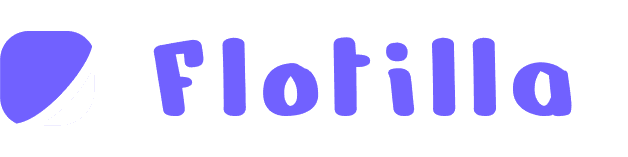
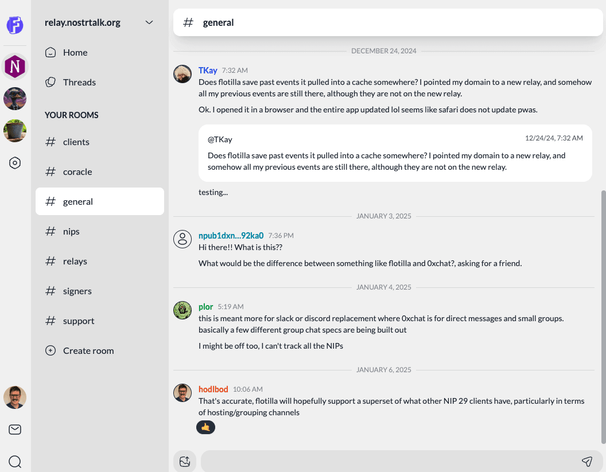
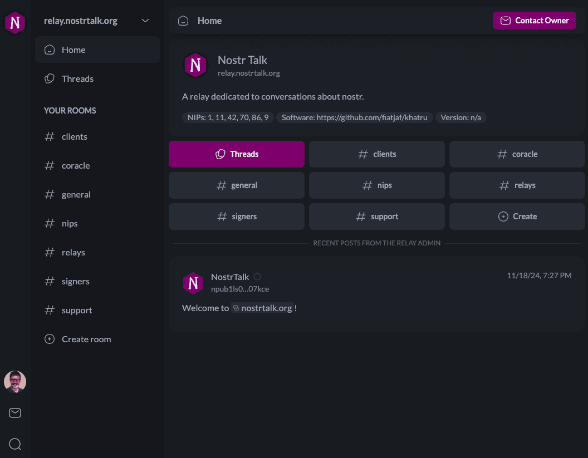
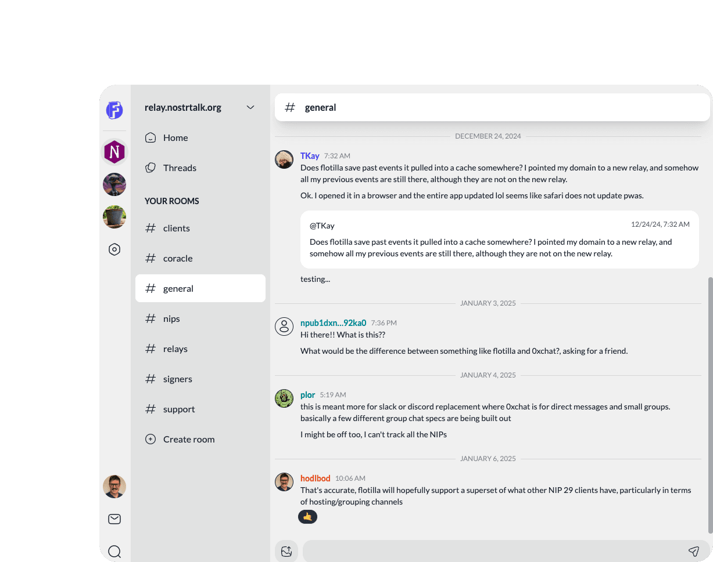
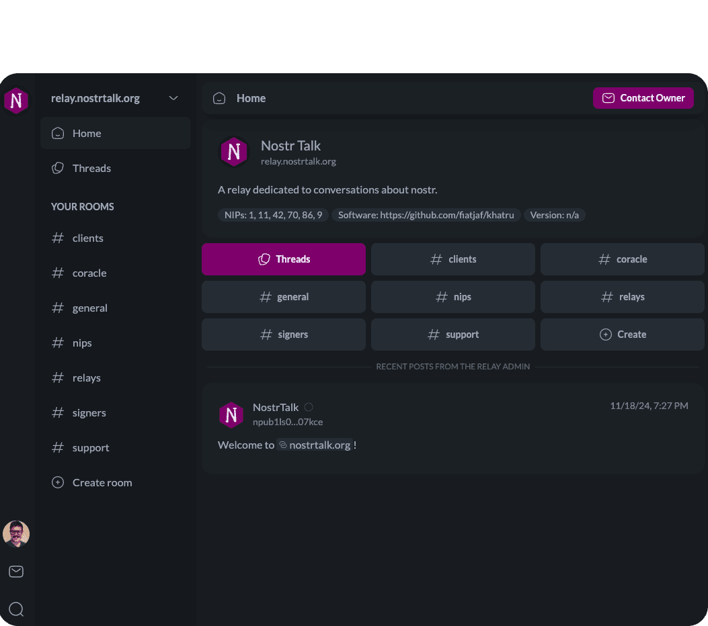
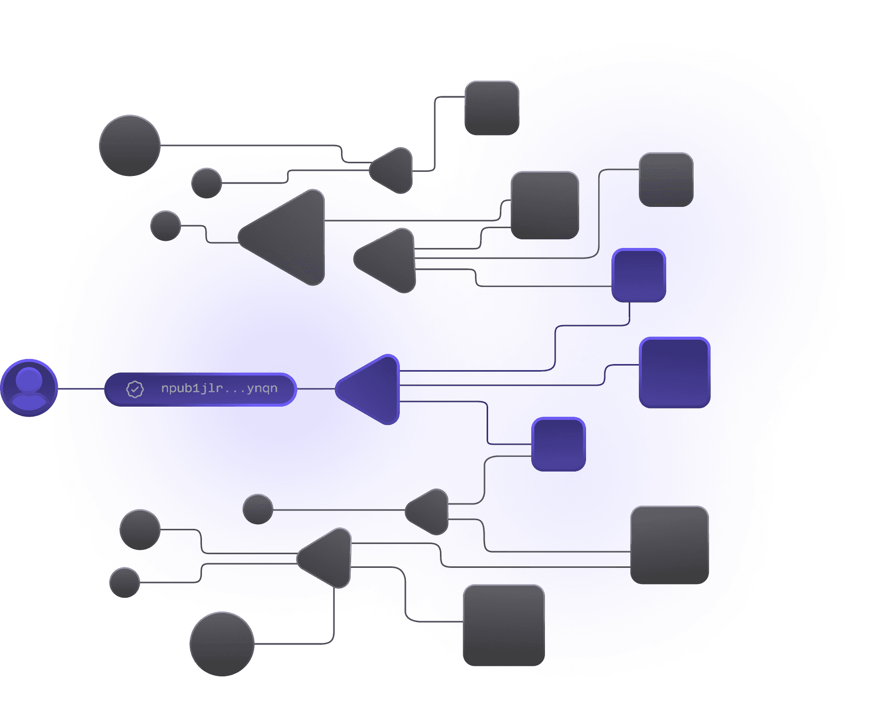
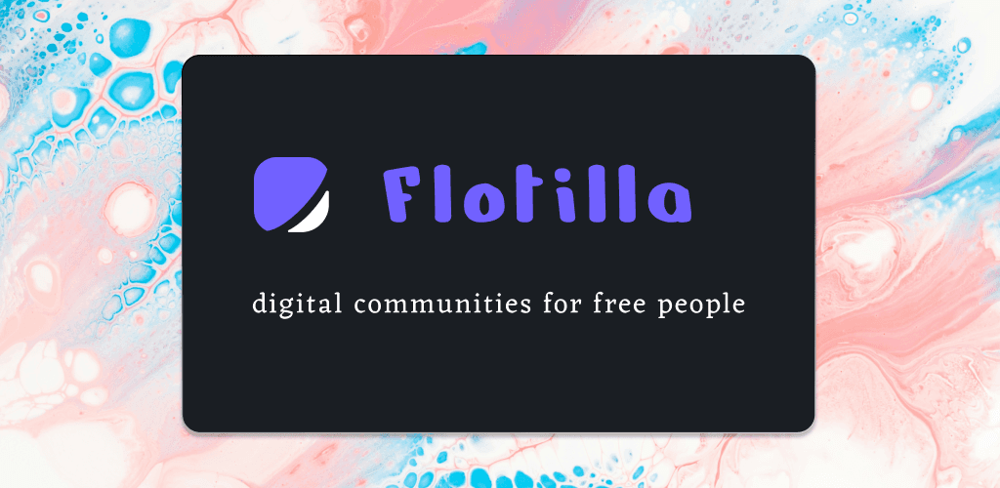

```yaml
title: Flotilla Social
meta_description: |
  Experience a new way to connect with your community online. Join an existing
  community space or launch your very own branded platform tailored to your
  audience. The decentralized Discord alternative built on the Nostr protocol.
og:
  type: website
  title: Flotilla Social
  url: https://flotilla.social/
  description: |
    Experience a new way to connect with your community online. Join an existing
    community space or launch your very own branded platform tailored to your
    audience. The decentralized Discord alternative built on the Nostr protocol.
  image: ../assets/TN5zzeaCSU1NAbL54TWg4ZEzA.png  # framer: TN5zzeaCSU1NAbL54TWg4ZEzA.png
twitter:
  card: summary_large_image
  title: Flotilla Social
  description: |
    Experience a new way to connect with your community online. Join an existing
    community space or launch your very own branded platform tailored to your
    audience. The decentralized Discord alternative built on the Nostr protocol.
  image: ../assets/TN5zzeaCSU1NAbL54TWg4ZEzA.png
robots: max-image-preview:large
favicons:
  light: ../assets/P2QcXrdBMBnM0bdWIFLK4D4lEes.png   # rel="icon" media="(prefers-color-scheme: light)"
  dark:  ../assets/ZV15kjIUQtVxwBeT7fxFCIPaMto.png   # rel="icon" media="(prefers-color-scheme: dark)"
  apple_touch_icon: ../assets/8UjnVxSvRkmvY2lEYU5z8OMOw0M.png
```

# Flotilla Social — Home

## Page outline

1. **Top navigation** — Flotilla wordmark logo on the left; "Log In" link and "Book a Demo" pill button on the right (mobile collapses to logo + "Login" outline button).
2. **Hero** — headline "Your Community, Your Rules.", subhead, three image-button CTAs ("Use in your Browser", App Store, Google Play), plus secondary "Book a Demo" / "Knowledge Base" buttons, with a desktop product screenshot collage (chat view + dark home overlay) and a mobile-only stacked screenshot.
3. **Create your own Community Platform** — three-up icon-card grid (Personalize / Organize / Connect) + "Book a Demo" button.
4. **Nostr, Your Way** — section intro and a 3x3 grid of feature tiles with line icons (Join Multiple Groups, Event Calendar, Zaps, Threads, Chat Rooms, Web of Trust, Custom Access Policies, White-Labeled Instance, Private Messages).
5. **No Ads, No Spying** — split layout: heading + body + buttons on one side, decorative network-graph illustration on the other.
6. **See it in action** — eyebrow heading + supporting line, embedded 4-minute video tour with custom poster image.
7. **Discover a New Way to Connect (final CTA)** — rounded card with headline and inverted "Try Flotilla" button, sitting just above the footer.
8. **Footer** — Flotilla logo, two columns of links (Login, Book a Demo, Github / NostrApp, Podcast, Blog), copyright, Terms and Privacy links.

## Top navigation (Global)

**Layout:** Single horizontal bar that sits above the hero. Desktop: logo on the left, link + button group on the right. Mobile: logo on the left, single outline "Login" button on the right (the "Book a Demo" pill is dropped on mobile).

**Copy:**
- Logo (image-only, links to home)
- Text link: `Log In`
- Pill button: `Book a Demo`
- Mobile-only outline button: `Login`

**Images:**
-  — desktop top-bar logo, links to `./`
-  — mobile top-bar logo, links to `./`

**Links / CTAs:**
- Logo → `./`
- `Log In` → `https://app.flotilla.social`
- `Book a Demo` → `https://cal.com/coracle.social`
- `Login` (mobile outline) → `https://app.flotilla.social`

## Hero

**Layout:** 1-column centered on mobile, 2-column on desktop with copy + CTA stack on the left and a product-screenshot collage on the right. Above the desktop screenshot is a dark vignette overlay; the desktop view layers a "base" chat screenshot with a "custom" dark Home overlay floating on top, plus a couple of small "RELAYS" cards floating beside it.

**Copy:**
- H1: `Your Community, Your Rules.` (rendered as two lines: "Your **Community**," then "Your Rules.")
- Subhead (desktop / tablet): `Experience a new way to connect with your people online. Join an existing community space or launch your very own branded platform tailored to your audience.`
- Subhead (mobile only): `Experience a feature-rich nostr client that gives you all the control. Browse your favorite relays or launch your very own branded platform tailored to your audience.`
- Primary CTA pill button: `Book a Demo`
- Secondary CTA pill button: `Knowledge Base`
- Plus three image-link badges: "Use in your Browser", "Download on the App Store", "Get it on Google Play"

**Images:**
-  — "Use in your Browser" CTA badge linking to the web app.
-  — App Store CTA badge.
-  — Google Play CTA badge.
- ![[inferred] Soft black-to-transparent vignette gradient](../assets/cBs1EIDbLYOHshrOUgTEsf1Dfk.png) — the desktop hero overlay/fade behind the product screenshots.
-  — desktop hero "base" product screenshot.
-  — desktop hero "custom" overlay screenshot, layered on top of the base.
- ![[inferred] White rounded card frame used for floating relay cards](../assets/YBbVblyQR90lGwh3Wad732t3gk.png) — RELAYS card frame (rendered twice, decorative).
- ![[inferred] Light-grey rounded placeholder for relay item](../assets/ILI5dunAUhoWhZ7ZpkHljQJ0.png) — relay-row swatch inside the floating RELAYS card (rendered twice).
-  — mobile hero screenshot (rendered twice for SSR/hover variants).
-  — second mobile hero screenshot, stacked under the first.

**Links / CTAs:**
- "Use in your Browser" badge → `https://app.flotilla.social`
- App Store badge → `https://apps.apple.com/us/app/flotilla-chat/id6741344107`
- Google Play badge → `https://play.google.com/store/apps/details?id=social.flotilla&pcampaignid=web_share`
- `Book a Demo` (Large) → `https://cal.com/coracle.social`
- `Knowledge Base` (Large - Secondary) → `./articles`

## Create your own Community Platform

**Layout:** Center-aligned eyebrow / headline / subhead at the top, then a 3-up card grid below (stacks 1-up on mobile). Each card has a coloured line-icon at the top, then a heading and a body line. A single "Book a Demo" pill button sits centered below the cards.

**Copy:**
- Eyebrow / first line: `Create your own`
- Heading (continuation): `Community Platform`
- Subhead: `Cultivate your community with your very own personalized social media platform.`
- Card 1 — `Personalize`: `Make your mission pop with a white-labeled instance, complete with full content curation.`
- Card 2 — `Organize`: `Use your own relays and turn on only the features you want, including events, threads, chat, or zaps for monetization.`
- Card 3 — `Connect`: `Engage with group members, organize events, or share exclusive content.`
- Button: `Book a Demo`

**Images:** No raster images in this section — each card uses an inline data-URI SVG as its icon (purple `rgb(113, 97, 255)` accent over white outline strokes, 48x48 viewBox):
- Card 1 icon (`toggles 1`) — toggle/sliders pictogram (settings/personalize).
- Card 2 icon (`cards 2`) — cards/list pictogram (organize).
- Card 3 icon (`nodes-3 1`) — connected-nodes pictogram (connect).

**Links / CTAs:**
- `Book a Demo` → `https://cal.com/coracle.social`

## Nostr, Your Way

**Layout:** Centered headline + supporting line at the top, followed by a 3x3 feature grid (3 columns × 3 rows on desktop; collapses to fewer columns on smaller breakpoints). Each tile has an outline-style line-icon and a single line of bold white label text on a dark background.

**Copy:**
- H2: `Nostr, Your Way` (rendered as two lines: "Nostr," / "Your Way")
- Subhead: `Customize your online community platform with Flotilla.`
- Feature tile labels (in DOM order):
  1. `Join Multiple Groups`
  2. `Event Calendar`
  3. `Zaps`
  4. `Threads`
  5. `Chat Rooms`
  6. `Web of Trust`
  7. `Custom Access Policies`
  8. `White-Labeled Instance`
  9. `Private Messages`

**Images:** No raster images. Each feature uses an inline `<svg>` icon (24x24 viewBox) referenced by `<use href="#...">`. Note: the underlying icon names in `data-framer-name` don't match the rendered labels — Framer kept the original icon files when copy was reworked. Mapping:

| Label | Underlying icon name | Visual |
|---|---|---|
| Join Multiple Groups | `code-editor 1` | code-editor glyph (likely repurposed) |
| Event Calendar | `calendar-planning 1` | calendar |
| Zaps | `bolt 1` | lightning bolt |
| Threads | `album-2 1` | stacked album/thread |
| Chat Rooms | `unordered-list-2 1` | bulleted list |
| Web of Trust | `badge-check 1` | check-marked badge |
| Custom Access Policies | `users-6 1` | group of users |
| White-Labeled Instance | `window-paintbrush 1` | window with paintbrush |
| Private Messages | `messages 1` | speech bubbles |

**Links / CTAs:** none in this section.

## No Ads, No Spying

**Layout:** Two-column hero-style block. On the left: stacked headline + body + button row. On the right: a decorative "network of nodes" illustration. On mobile this stacks (text above image).

**Copy:**
- H2: `No Ads, No Spying`
- Body (two-sentence paragraph with `Nostr is Freedom Tech.` styled as the bold lead-in): `Nostr is Freedom Tech. Cryptographic key pairs and an open protocol make it possible for you to own your data, and bring it anywhere.`
- Primary button: `Try Flotilla`
- Secondary button: `Learn More`

**Images:**
-  — "No Ads, No Spying" right-side illustration (rendered twice for SSR variants).

**Links / CTAs:**
- `Try Flotilla` (Large) → `https://app.flotilla.social`
- `Learn More` (Large - Secondary) → `https://nostr.com/`

## See it in action (Video)

**Layout:** Centered eyebrow + headline + supporting line, then a single rounded-corner video player (22px border-radius) below.

**Copy:**
- Eyebrow / kicker: `See it in action`
- H2: `Nostr, Your Way` (rendered "Nostr," / "Your Way")
- Supporting line: `Watch our 4-minute video tour.`

**Images:**
-  — video poster (`<video poster="...">`).

**Embedded video:**
- `<video>` source: `https://coracle-media.us-southeast-1.linodeobjects.com/flotilla-tour.mov`
- attrs: `preload="none"`, `controls`, `playsinline`, rounded `22px` corners, `object-fit: cover`.

**Links / CTAs:** none (only the inline video controls).

## Discover a New Way to Connect (final CTA)

**Layout:** Wide rounded-corner card sitting above the footer. Single column, center-aligned: headline on top, single inverted (light-on-dark or dark-on-light contrast) "Try Flotilla" button below. The Framer source named this block `Ready to jump in?` but it renders the copy below.

**Copy:**
- H2: `Discover a New Way to Connect`
- Inverted CTA button: `Try Flotilla`

**Images:** none (this CTA card is type/button only).

**Links / CTAs:**
- `Try Flotilla` (Large - Inverted) → `https://app.flotilla.social`

## Footer (Global)

**Layout:** Three-region footer. On desktop the Flotilla logo sits on the left; two columns of text links sit on the right (Login / Book a Demo / Github stacked, then NostrApp / Podcast / Blog stacked). The bottom strip carries `© 2026 Coracle Social` on the left and `Terms of Service • Privacy Policy` on the right. The same content is duplicated three times in the markup for Desktop, Tablet, and Phone breakpoint variants.

**Copy:**
- Column 1 links: `Login`, `Book a Demo`, `Github`
- Column 2 links: `NostrApp`, `Podcast`, `Blog`
- Copyright: `© 2026 Coracle Social`
- Bottom-right: `Terms of Service` `•` `Privacy Policy`

**Images:**
-  — footer logo (same asset as desktop nav logo, rendered three times for breakpoint variants).

**Links / CTAs:**
- `Login` → `https://app.flotilla.social`
- `Book a Demo` → `https://cal.com/coracle.social`
- `Github` → `https://github.com/coracle-social/flotilla`
- `NostrApp` → `https://nostrapp.link/a/naddr1qqxnzd3cx5unvwps8yenvwfsqgsf03c2gsmx5ef4c9zmxvlew04gdh7u94afnknp33qvv3c94kvwxgsrqsqqql8kylym66/reviews`
- `Podcast` → `https://fountain.fm/show/vnmoRQQ50siLFRE8k061`
- `Blog` → `https://hodlbod.npub.pro/`
- `Terms of Service` → `https://app.flotilla.social/terms.html`
- `Privacy Policy` → `https://app.flotilla.social/privacy.html`

## Visual style notes

**Brand colors (from inline styles, ranked by frequency):**
- `rgb(255, 255, 255)` / `#ffffff` — primary text/foreground on dark surfaces.
- `rgb(17, 17, 17)` / `#171717` and `rgb(23, 23, 23)` / `#171717` — near-black background of the page (multiple shades used as cards / surfaces).
- `rgb(252, 86, 14)` / `#fc560e` — accent **orange** (toggle "On" state in the floating RELAYS card; CSS var token `--token-bca57de3-…`). This is the secondary accent.
- `rgb(113, 97, 255)` / `#7161ff` — accent **purple**, the Flotilla brand color, used for icon strokes in the "Personalize/Organize/Connect" SVGs and in the wordmark logo.
- `#bfb8ff` — light purple highlight (occasional).
- `rgb(0, 104, 198)` / `#0068c6` and `rgb(0, 153, 255)` / `#0099ff` — appear to be link blues from text inside hero screenshots (likely embedded in the rasterized chat screenshots, not actual page chrome).
- `rgb(29, 31, 51)` / `#1d1f33` — subtle dark surface variant.
- Tints/shadows: `#ffffff1a` (10% white), `#ffffff05` (~2% white), `#00000052` (~32% black), `#1717178f`, `#111111a3`, `#111111e3` — used for hairline borders and elevation overlays.

**Fonts (declared in the head and used in body):**
- Both `Lato` (with `Lato Placeholder` fallback) and `Fragment Mono` are loaded via Google Fonts `@font-face` blocks.
- In the rendered DOM, only **Lato** is referenced from inline styles — used for the feature-tile labels (`font-size:18px; font-weight:700; color:#fff; letter-spacing:-0.02em; line-height:150%`), which suggests Lato is the brand body/UI font.
- `Fragment Mono` is loaded but I could not find any inline `font-family` reference to it on this page — it may be applied via class only or scoped to other pages.
- `Inter` (Framer default) is referenced by the framer code-block CSS variable but most headings on this page render through framer-text classes that ultimately resolve to Lato. Note: a Framer "Inter Placeholder" fallback is present everywhere.

**Buttons & shape:**
- Primary buttons: solid pill-style, full-radius. Three sizes encountered: `Small`, `Large`, `Large - Secondary`, `Large - Inverted`, `Small - Outline`.
- Outline buttons used for the mobile "Login" nav button.
- The video player has a `border-radius: 22px`.
- Hero CTA badges (Browser / App Store / Google Play) use static 360×120 PNG images rather than HTML buttons.

**Effects:**
- Soft black-to-transparent vignette overlay (`cBs1EIDbLYOHshrOUgTEsf1Dfk.png`) is layered above the desktop hero screenshots to fade the bottom edge.
- Four `Ellipse 1` decorative blobs are positioned around the page (likely soft purple background glows behind sections), based on their top-level placement in the markup.
- The "RELAYS" floating cards have toggle-pill children styled with a CSS var token for the orange ON state.

**Layout / spacing:**
- Centered single-column page with full-width sections.
- Cards in the "Create your own" section: rounded with internal padding, dark surface, 3-up grid with the icon top-aligned.
- Feature tiles in "Nostr, Your Way" use a subtle white border (`#ffffff1a`) on a near-black surface.

## Images

| Local filename | Original Framer URL | Alt | Where used |
|---|---|---|---|
| `oxR4aBNhSwZ2eGyD8lS7hxvA8.png` | https://framerusercontent.com/images/oxR4aBNhSwZ2eGyD8lS7hxvA8.png | Flotilla wordmark logo (purple icon + "Flotilla" text) | Desktop top-nav logo; footer logo (×3 breakpoint variants) |
| `Y17iQIMRnSav4IKmdnrF5cKFNo.png` | https://framerusercontent.com/images/Y17iQIMRnSav4IKmdnrF5cKFNo.png | Flotilla wordmark logo (mobile variant) | Mobile top-nav logo |
| `Y5RG4WARG22im0gxdN5hBidDRk.png` | https://framerusercontent.com/images/Y5RG4WARG22im0gxdN5hBidDRk.png | "Use in your BROWSER" black pill badge with Flotilla mark | Hero CTA, links to app.flotilla.social |
| `f4TiV4LJ1AQ4XTQejg0vipwNBw.png` | https://framerusercontent.com/images/f4TiV4LJ1AQ4XTQejg0vipwNBw.png | Apple "Download on the App Store" badge | Hero CTA, links to App Store |
| `4plsOpupRU1vo0R8NzZHM5WvgA.png` | https://framerusercontent.com/images/4plsOpupRU1vo0R8NzZHM5WvgA.png | Google "Get it on Google Play" badge | Hero CTA, links to Google Play |
| `cBs1EIDbLYOHshrOUgTEsf1Dfk.png` | https://framerusercontent.com/images/cBs1EIDbLYOHshrOUgTEsf1Dfk.png | [inferred] black-to-transparent vignette gradient | Desktop hero overlay |
| `JkSFlhCUVXpF8koMaeKi3RdM7r8.png` | https://framerusercontent.com/images/JkSFlhCUVXpF8koMaeKi3RdM7r8.png | Flotilla web app screenshot, light theme, "general" channel chat | Desktop hero "base" screenshot |
| `Nx6uS8Wg0VAFS970dpdsxjvkaM.png` | https://framerusercontent.com/images/Nx6uS8Wg0VAFS970dpdsxjvkaM.png | Flotilla web app screenshot, dark theme, relay Home with quick-link grid | Desktop hero "custom" overlay screenshot |
| `YBbVblyQR90lGwh3Wad732t3gk.png` | https://framerusercontent.com/images/YBbVblyQR90lGwh3Wad732t3gk.png | [inferred] white rounded card frame | Floating "RELAYS" card frame in desktop hero (×2) |
| `ILI5dunAUhoWhZ7ZpkHljQJ0.png` | https://framerusercontent.com/images/ILI5dunAUhoWhZ7ZpkHljQJ0.png | [inferred] light-grey rounded placeholder | Relay-row swatch inside floating RELAYS card (×2) |
| `cvEuqymIjiPwYQQePaS3EjhCKk.png` | https://framerusercontent.com/images/cvEuqymIjiPwYQQePaS3EjhCKk.png | Flotilla mobile screenshot, light theme, #general channel chat | Mobile hero (×2 SSR variants) |
| `ZecxRVIbhYo8hTEN5rFvNbO5JY.png` | https://framerusercontent.com/images/ZecxRVIbhYo8hTEN5rFvNbO5JY.png | Flotilla mobile screenshot, dark theme, relay Home with quick-link grid | Mobile hero (second screenshot) |
| `f24oUUayMDxpXdqHcHpHYhFFhps.png` | https://framerusercontent.com/images/f24oUUayMDxpXdqHcHpHYhFFhps.png | Network-of-nodes illustration with highlighted "npub1jlr…ynqn" pill | "No Ads, No Spying" right-side illustration (×2 SSR variants) |
| `6sCyW16HLSqFcJfXEsrmNatgmK8.png` | https://framerusercontent.com/images/6sCyW16HLSqFcJfXEsrmNatgmK8.png | Flotilla brand card on watercolor background, "digital communities for free people" tagline | Video poster |
| `TN5zzeaCSU1NAbL54TWg4ZEzA.png` | https://framerusercontent.com/images/TN5zzeaCSU1NAbL54TWg4ZEzA.png | Flotilla brand card on watercolor background (16:9 OG variant) | og:image / twitter:image |
| `P2QcXrdBMBnM0bdWIFLK4D4lEes.png` | https://framerusercontent.com/images/P2QcXrdBMBnM0bdWIFLK4D4lEes.png | Flotilla mark (purple) on white, light-mode favicon | `<link rel="icon" media="(prefers-color-scheme: light)">` |
| `ZV15kjIUQtVxwBeT7fxFCIPaMto.png` | https://framerusercontent.com/images/ZV15kjIUQtVxwBeT7fxFCIPaMto.png | Flotilla mark (purple) on dark, dark-mode favicon | `<link rel="icon" media="(prefers-color-scheme: dark)">` |
| `8UjnVxSvRkmvY2lEYU5z8OMOw0M.png` | https://framerusercontent.com/images/8UjnVxSvRkmvY2lEYU5z8OMOw0M.png | Flotilla mark (purple) on dark rounded square, apple-touch-icon | `<link rel="apple-touch-icon">` |

### Notes / unknowns

- The Framer source's `data-framer-name` for the Hero (`Your Social Media, Your Rules.`) and final CTA (`Ready to jump in?`) were left over from earlier copy revisions — the rendered text is `Your Community, Your Rules.` and `Discover a New Way to Connect` respectively. Trust the rendered copy.
- Several feature-tile icons in "Nostr, Your Way" still carry their original Framer asset names (e.g. `code-editor 1` next to the "Join Multiple Groups" label). The icon sprites themselves (`<symbol>` defs) are loaded via external Framer JS at runtime, so I could not extract their literal SVG paths from this static HTML — only their symbol IDs.
- `Fragment Mono` is loaded in the head but I could not find any inline `font-family` use of it on this page; it may apply only to articles/blog content or via a class not exercised by index.html.
- The 4× `Ellipse 1` blocks at the top level have no text, no images, and no children — they are positioned background ellipse decorations (likely soft purple glows). Treat them as decorative and ignore unless rebuilding the exact silhouette.
- Each major section is duplicated in the SSR markup with `ssr-variant hidden-{breakpoint}` classes (mobile / tablet / desktop variants). When rebuilding in Astro, you only need one canonical version per section plus responsive CSS — don't duplicate the markup.
